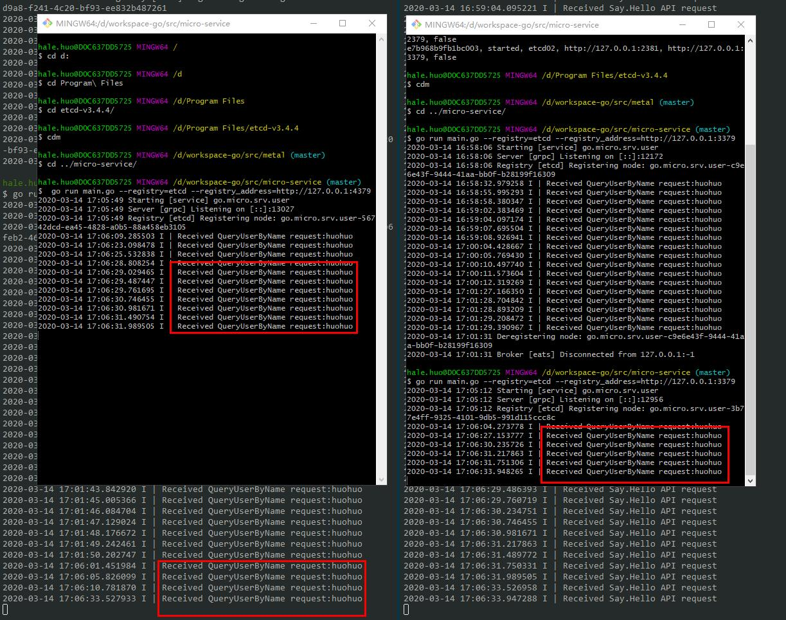

# micro-service
go语言微服务

## Getting Started

- [教程](https://micro.mu/docs/go-helloworld.html)
- [用户服务](https://github.com/micro-in-cn/tutorials/tree/master/microservice-in-micro/part1)

## 依赖

grpc v1.25.1，
v1.27.1会有类型这样的错误`undefined: resolver.BuildOption`,`undefined: resolver.ResolveNowOption`

## Usage
生成*.pb.go代码
```shell
$ protoc --proto_path=. --micro_out=. --go_out=. proto/user/user.proto
```
启动服务和测试
```shell
go run main.go
```
```shell
go run client/main.go
```

### 开启api服务
```shell
go run main.go
```
```shell
go run api/api.go
```
```shell
micro api --handler=api
```
```shell
curl "http://localhost:8080/user/say/hello?name=huohuo"
```
返回
{"id":"123","password":"dslhgfoif40u9b9","username":"huohuo"}

### api层说明：
API模块，它的身份其实就是一个网关或者代理层，它的能力就是让一个单一的入口可以去访问微服务。API工作在我们的软件服务架构的边缘。

## 服务注册服务
v2.0版本默认使用的服务注册发现是**mdns**。
Micro内置了mDNS组播系统，这是一种零依赖的服务注册发现机制，它是区别于有注册中心的替代方案。
通过在启动指令中传入--registry=mdns 或者在环境变量中设置MICRO_REGISTRY=mdns。
其实也可以不传，早期版本的go-micro默认注册中心是consul，现在换成了mdns
mDNS（多播DNS）是一种局域网内使用的DNS机制，他的大致原理如下：当有新的节点加入局域网的时候，如果打开了mDNS，就主动向局域网其他所有节点广播，自己提供的服务（域名是什么、ip地址是什么、端口号是什么）, 这样我们任何一个节点都知道局域网提供了什么服务。
所以生产环境需要其他中间件，如**consul**，**etcd**。

## 使用etcd作为服务发现中间件
go-micro v2弃用了**consul**，推荐使用的是**etcd**。
使用方法：
```shell
go run main.go --registry=etcd
```
```shell
go run api/api.go --registry=etcd
```
```shell
micro --registry=etcd api --handler=api
```
在启动的时候加上`--registry=etcd`参数即可，启动日志如下：
```cassandraql
2020-03-14 16:17:07 Starting [service] go.micro.srv.user
2020-03-14 16:17:07 Server [grpc] Listening on [::]:10507
2020-03-14 16:17:07 Registry [etcd] Registering node: go.micro.srv.user-332fd9a8-f241-4c20-bf93-ee832b487261
```
`Registry [mdns]`变成了`Registry [etcd]`。
### 启动三个etcd实例：
```shell script
.\etcd.exe --name etcd01 ^
--data-dir .\data\etcd01 ^
--advertise-client-urls http://127.0.0.1:2379 ^
--listen-client-urls http://127.0.0.1:2379 ^
--listen-peer-urls http://127.0.0.1:2380 ^
--initial-advertise-peer-urls http://127.0.0.1:2380 ^
--initial-cluster-token etcd-cluster-1 ^
--initial-cluster etcd01=http://127.0.0.1:2380,etcd02=http://127.0.0.1:2381,etcd03=http://127.0.0.1:2382 ^
--initial-cluster-state new

pause
```
```shell script
.\etcd.exe --name etcd02 ^
--data-dir .\data\etcd02 ^
--advertise-client-urls http://127.0.0.1:3379 ^
--listen-client-urls http://127.0.0.1:3379 ^
--listen-peer-urls http://127.0.0.1:2381 ^
--initial-advertise-peer-urls http://127.0.0.1:2381 ^
--initial-cluster-token etcd-cluster-1 ^
--initial-cluster etcd01=http://127.0.0.1:2380,etcd02=http://127.0.0.1:2381,etcd03=http://127.0.0.1:2382 ^
--initial-cluster-state new

pause
```
```shell script
.\etcd.exe --name etcd03 ^
--data-dir .\data\etcd03 ^
--advertise-client-urls http://127.0.0.1:4379 ^
--listen-client-urls http://127.0.0.1:4379 ^
--listen-peer-urls http://127.0.0.1:2382 ^
--initial-advertise-peer-urls http://127.0.0.1:2382 ^
--initial-cluster-token etcd-cluster-1 ^
--initial-cluster etcd01=http://127.0.0.1:2380,etcd02=http://127.0.0.1:2381,etcd03=http://127.0.0.1:2382 ^
--initial-cluster-state new

pause
```
启动两个新的服务并注册到etcd中
```shell script
 go run main.go --registry=etcd --registry_address=http://127.0.0.1:3379
```
```shell script
 go run main.go --registry=etcd --registry_address=http://127.0.0.1:4379
```
多次请求http://localhost:8080/user/say/hello?name=huohuo
会在三个服务轮询接收请求

停止某个服务并不会中断服务，以此实现了服务注册发现。